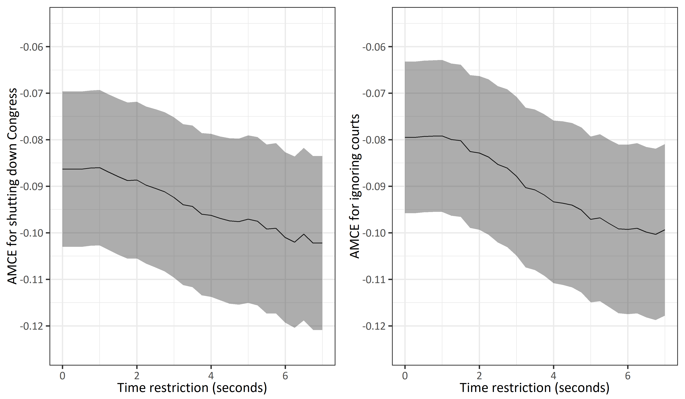

```{r setup, include=FALSE}
knitr::opts_chunk$set(echo = FALSE)
```

## Outline 
Plan for today:

1. Why conjoint experiments? 
2. Estimation properties  
3. Break (create Qualtrics account) 
4. Implementation in Qualtrics 
5. Analysis in R \pause 

We'll be using quite a few different tools - Qualtrics and R, but also: \pause

- HTML, to format the conjoint table in Qualtrics \pause 
- Javascript, to handle randomization of attributes in Qualtrics \pause

I'll provide everything necessary for this

# Why use conjoint experiments? 
## What does a conjoint look like? 


## Terminology
Following Hainmueller et al. 2014:

- A sample of N respondents \pause 
- Respondent $i \in \{1,...,N\}$ is presented with $K$ tasks \pause 
- For any given task $k$, there are $J$ profiles to choose from \pause 
- Any given profile $j$ has $L$ attributes \pause
- Any given attribute $l$ has $D_l$ distinct values \pause 

Tasks\pause \rightarrow Profiles \pause \rightarrow Attributes \pause \rightarrow Attribute levels 
\pause 
\newline Upshot: There are a lot of moving parts!
\pause
\newline And each of these moving parts implies a decision 

## Applying terminology 


## Advantages 
Hainmueller et al. (2014) mention four advantages:

1. Enhanced realism: mimics the multidimensional nature of political behavior \pause
2. Cost-effective: allows to test multiple hypothesized effects \pause
3. Easy comparisons of explanatory power of different hypotheses \pause 
4. Reduced potential for social desirability bias 

# Estimation properties 

## QoI

Our quantity of interest is the \textbf{Average Marginal Component Effect} (AMCE) \pause

- The expected change in the probability that a profile is chosen...\pause
- caused by a change of some attribute from its reference level $t_0$ to some level $t_1$...\pause
- averaged over all possible values of the other attributes \pause 

Positive AMCE: attribute level increases probability that profile is chosen compared to reference level \pause 

This \textbf{cannot} be interpreted as representing majority/minority \pause 

- The AMCE is sensitive to preference intensity \pause 
- Most preference aggregation processes we're interested in are not! \pause
- Upshot: A negative AMCE does not mean that a majority dislikes a given attribute level \pause
- More info: [Abramson, Kocak, and Magazinnik](https://scholar.princeton.edu/sites/default/files/kkocak/files/conjoint_draft.pdf)

## Other QoI

Another quantity of interest is the \textbf{marginal mean} \pause

- Probability that a profile with attribute level $t$ is selected \pause
- The AMCE is the difference in MMs with reference level \pause 

\begin{table}[]
\begin{tabular}{@{}lll@{}}
\toprule
Party      & MM   & AMCE  \\ \midrule
Democrat   & 0.56 & 0     \\
Republican & 0.44 & -0.12 \\ \bottomrule
\end{tabular}
\end{table}

\pause

- Comparing AMCEs across subgroups: distortion due to reference level (Leeper, Hobolt, and Tilley 2020)

## Estimation 

All we need is to run a linear model: \pause

- Dataset: Each row is one profile from one task performed by a given respondent \pause 
- DV: Dummy indicator for whether profile was chosen \pause 
- RHS: Factor variables that contain the attribute levels \pause
- Cluster SEs by respondent \pause 

Two things to note: 

- Choice of reference level matters \pause
- Dataset gets large quickly: 2,000r x 6t x 2p = 24,000 profiles

## Assumption 1: Stability/no carry-over 

1. Stability/no carry-over effects 

- We want to harness power of repeated tasks \pause
- For that, we need to know that a given respondent would make the same choice between some  profile A and some profile B *regardless of task #* \pause
- Violated if: attentiveness decreases; content of past profiles changes behavior \pause 
- Bansak et al. 2018: 1st task vs 2nd task vs $n^{th}$ task \pause

Diagnostics: 

- Produce task-specific AMCEs and compare \pause
- Formal test (using `cregg` package)

## Assumption 1: Stability/no carry-over 


## Assumption 1: Stability/no carry-over  
\scriptsize
```{r,echo=TRUE,include=TRUE}
load("survey.Rdata")
library(cregg)
cj_anova(data = conjoint_congress,
         formula = selected ~ cand_gender + cand_age + 
           experience + party + policy1 + policy2 + democracy,
         id = ~id,
         by = ~profile)
```

## Assumption 2: No profile-order effects

2. Profile-order effects

- In a given task, choice should be the same regardless of profile-order \pause 
- Left profile might be more popular! \pause 
- Given randomization, we expect 50%-50% \pause 

Diagnostics:

- % of time each profile is chosen \pause 
- Visual comparison: MMs by profile number \pause 

No fix for profile-order effects; sample quality is paramount! 

## Assumption 2: No profile-order effects


## Assumption 3: proper randomization 

3. Randomization

- No link between profile characteristics and respondent characteristics \pause
- Not problematic with medium + samples \pause 
- Regress respondent characteristic on attributes \pause 

\scriptsize
```{r,echo=TRUE,include=TRUE,message=FALSE,warning=FALSE}
library(dplyr)
model <- lm(lockdown_support_scale ~ cand_gender + cand_age + 
           experience + party + policy1 + policy2 + democracy,
   data = conjoint_congress) %>% summary()

model$fstatistic
```

## Assumption 4: No row-order effects

The effect of some attribute $l$ should not change depending on where $l$ is placed in the profiles \pause

- Order of attributes often randomized across respondents \pause
- Not within because of cognitive load \pause
- (This involves more complex javascript code) \pause 

Diagnostics: visual inspection, formal test 

## Assumption 4: No row-order effects


## Assumption 4: No row-order effects
\scriptsize
```{r,include=TRUE,echo=TRUE}
cj_anova(data = conjoint_courts,
         formula = selected ~ cand_gender + cand_age + 
           experience + party + policy1 + policy2 + democracy,
         id = ~id,
         by = ~democracy_row)
```


## Design: which/how many attributes?

- Masking-satisficing tradeoff \pause
- Masking: included attribute is perceived to be correlated with excluded attribute \pause 
- No "bias" in the traditional sense:
\scriptsize
“It is important to recognize that masking is distinct from omitted variable bias in that an estimate of an effect might be masking another while remaining a valid causal estimate. In the presence of masking, it is not that the researcher is getting an incorrect answer so much as she is asking a different question. If B is omitted, researchers get a valid estimate of the AMCE of A defined as the causal effect of A conditional on the design excluding B. If B is included, researchers still recover a valid estimate of A’s AMCE, but that AMCE has a different meaning because it is now defined as the causal effect of A conditional on the design including B.” (Bansak et al. 2019)
\normalsize
- 6 to 8 attributes is generally reasonable \pause
- Modest increases in satisficing as # of attributes increases \pause
- My take: don't ask too much of respondents and consider the "difficulty" of attributes 

## Design: number of tasks

More tasks: 

- More statistical power \pause
- Increased risk of satisficing \pause
- 6 to 8 is generally a good middle ground 
Bansak et al. 2018:


## Design: inattentiveness

- To make assumptions more plausible, have a quality sample \pause
- Not much advice that's specific to conjoint experiments \pause
- One solution: iteratively exclude respondents based on time 

\scriptsize
```{r,echo=TRUE,eval=FALSE}
dem_estimate <- data.frame(restriction = seq(0, 7, .25),
                           estimate_congress = NA,
                           lwr_congress = NA,
                           upr_congress = NA)
for(i in 0:28){
  conjoint_restricted_congress <- filter(conjoint_congress, task_time > i*0.25)
  dem_estimate[i+1,2:4] <- cregg::cj(conjoint_restricted_congress,
            formula = f1,
            id = ~id) %>% 
    filter(level == "Shut down Congress") %>% 
    dplyr::select(estimate, lower, upper) %>% 
    as.vector() %>% 
    as.numeric()
}
```

## Design: inattentiveness


## Design: Non-uniform distribution

- Attribute $l$ with 4 levels: each level has a 0.25 probability \pause
- Non-uniform distribution: more closely approximate population distribution \pause
- e.g. ethnicity of political candidates \pause
- modify javascript code to do this \pause
- Hainmueller et al. 2014: don't do this unless there's a "strong substantive reason" \pause
- de la Cuesta, Egami, and Imai (forthcoming in PA): improve external validity by mimicking target profile distribution

## Atypical attribute combinations

- So far, no restrictions of values of some attribute $l_2$ based on value of attribute $l_1$ \pause
- Example: attribute A is "party" and attribute B is "position on healthcare" \pause
- Hainmueller et al. 2014: atypical vs meaningless \pause 
- Restrictions on randomness complicate the estimation procedure 

# Implementation in Qualtrics
## Our example today
\begin{figure}[ht] 
  \label{ fig7} 
  \begin{minipage}[b]{0.5\linewidth}
    \centering
    \includegraphics[]{clem.jpg}
  \end{minipage}%%
  \begin{minipage}[b]{0.5\linewidth}
    \centering
    \includegraphics[]{arthur.jpg} 
  \end{minipage} 
  \begin{minipage}[b]{0.5\linewidth}
    \centering
    \includegraphics{lili.jpg} 
    \vspace{4ex}
  \end{minipage}%% 
  \begin{minipage}[b]{0.5\linewidth}
    \centering
    \includegraphics{oscar.jpg} 
    \vspace{4ex}
  \end{minipage} 
\end{figure}

## Attributes for today 

\tiny
\begin{table}[]
\begin{tabular}{@{}lllllll@{}}
\toprule
\textbf{Attribute} & \textbf{Level 1} & \textbf{Level 2}   & \textbf{Level 3} & \textbf{Level 4} & \textbf{Level 5} & \textbf{Level 6} \\ \midrule
Sex                & Male             & Female             &                  &                  &                  &                  \\
Age                & 3 months         & 6 months           & 1 year           & 3 years          & 7 years          & 11 years         \\
Color              & Black            & Light brown        & White            & Light grey       &                  &                  \\
Fur type           & Long hair        & Short hair         &                  &                  &                  &                  \\
Breed              & Bengal           & Maine Coon         & Persian          & Moggie           &                  &                  \\
Character          & Energetic/cuddly & Energetic/solitary & Sleepy/cuddly    & Sleepy/solitary  &                  &                  \\ \bottomrule
\end{tabular}
\end{table}

\normalsize
2x6x4x2x4x4 = 1,536 distinct profiles

## Workflow
1. Create our survey in Qualtrics
2. Modify the HTML template according to your design 
3. Modify the Javascript template according to your design
4. Set embedded data to save observed profiles
5. Set up the randomizer in "Survey Flow"
6. Use the HTML code as the question content 
7. Insert Javascript code 
