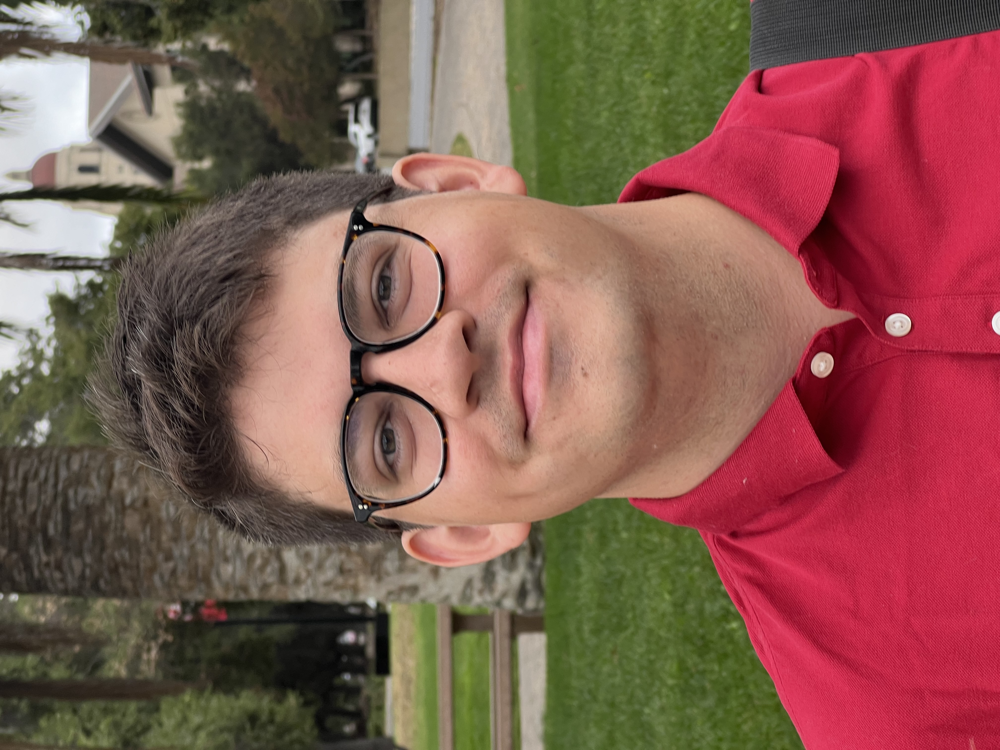

I am a PhD student in political science at the University of California, Berkeley. I hold an M.A. and B.A. in Political Science from McGill University in Montreal. I was previously a research associate at Dartmouth College and at Stanford's Graduate School of Business. I am interested in political behavior and political economy, with methodological interests in causal inference, survey research, and metascience. My recent research focuses on citizens' attitudes toward democracy; expert forecasting; information consumption and social media; and political polarization. 

You can find a copy of my CV <a href="cv/cv_2.pdf"><u>here</u></a>.

<b>Publications</b>

4\. <a href="https://portal.electioncenter.org/common/Uploaded%20files/Journals/JEARP%20Vol%203%20SI.pdf#page=60"><u>"Communicating with Voters to Build Trust in the U.S. Election System."</u></a><i>Journal of Election Administration, Research & Practice</i>, with Katherine Clayton, Thad Kousser, Brendan Nyhan, and Lauren Prather. 

3\. <a href="https://www.cambridge.org/core/journals/ps-political-science-and-politics/article/expert-bias-and-democratic-erosion-assessing-expert-perceptions-of-contemporary-american-democracy/0620719DD8C8A4FE1055AF268A3732E0"><u>"Expert Bias and Democratic Erosion: Assessing Expert Perceptions of Contemporary American Democracy"</u></a>, <i>PS: Political Science and Politics</i>, with John Carey, Gretchen Helmke and Eli Rau. 

2\. <a href="https://www.cambridge.org/core/journals/canadian-journal-of-political-science-revue-canadienne-de-science-politique/article/covid19-and-support-for-executive-aggrandizement/51E9E60701AAEF93C01EB3D2E8BE0A69"><u>"COVID-19 and Support for Executive Aggrandizement"</u></a><i> Canadian Journal of Political Science</i>, with Elisabeth Gidengil and Dietlind Stolle. 

1\. <a href="https://ejpr.onlinelibrary.wiley.com/doi/10.1111/1475-6765.12502"><u>"The partisan nature of support for democratic backsliding: A comparative perspective"</u></a><i> European Journal of Political Research</i>, with Elisabeth Gidengil and Dietlind Stolle. 

<b>Work in progress</b>

1\. "Feedback Eliminates the Perverse Effects of Interventions Against Misinformation." With Brendan Nyhan, Kathleen Dowling, and Cameron Hickey. 

2\. <a href="papers/Bergeron-Boutin_Olivier_PoliticalScience_thesis.pdf"><u>Measuring Social Sorting and Its Association with Affective Polarization.</u></a>

3\. <a href="work_in_progress/knowledge_assessments_ms_csdc.pdf"><u>"Do Americans Know What They Don't Know?"</u></a>, with Philippe Chassé (Université de Montréal). 

&nbsp;

