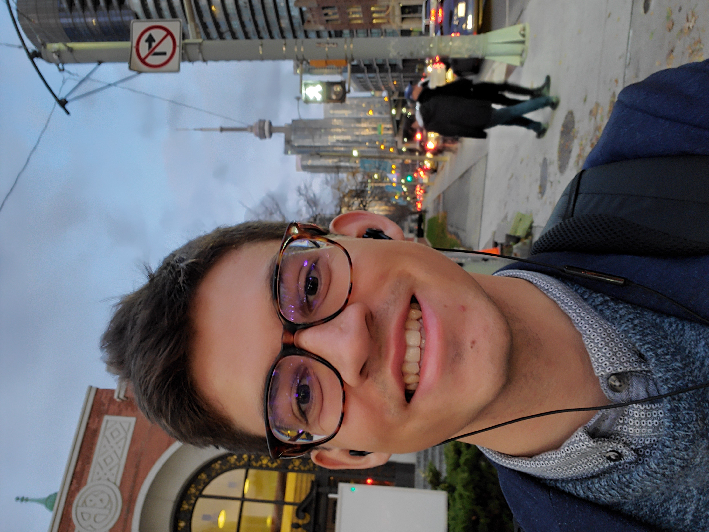

I am currently a Research Associate at Dartmouth College working with <a href="brightlinewatch.org"><u>Bright Line Watch</u></a>. I am also a masters student in Political Science at McGill University. I hold a B.A. in Political Science from McGill (2018). 

I'm interested, broadly speaking, in political behavior and political economy, with methodological interests in causal inference and survey research. My recent research focuses on citizens' attitudes toward democracy and pathways to democratic backsliding. 

You can find a copy of my CV <a href="cv/cv_2.pdf"><u>here</u></a>.

<b>Publications</b>
<a href="cv/cv_2.pdf"><u>here</u></a>
